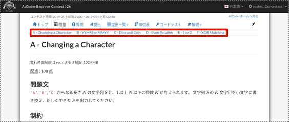

# atcoder-problem-navigator

Shows a navigation bar on AtCoder contest pages for jumping to problems.

## Usage

1. Install [Tampermonkey](https://tampermonkey.net/) on your browser.
2. Go to [this page](https://greasyfork.org/en/scripts/383360-atcoder-problem-navigator) and install atcoder-problem-navigator.
3. Access a problem list page (`https://atcoder.jp/contests/CONTEST_NAME/tasks`). 

Once you access the problem list page, the navigation bar is always shown for the contest.
