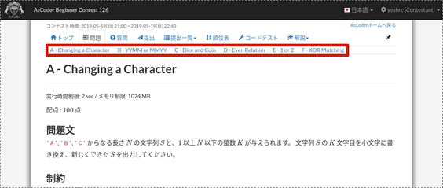
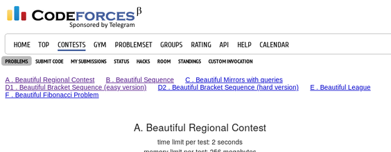

# atcoder-problem-navigator

Shows a navigation bar on AtCoder and Codeforces contest pages for jumping to problems.

AtCoder・Codeforcesのコンテストページ上部に、各問題へのリンクを表示します

## Usage　/ 使い方

1. Install [Tampermonkey](https://tampermonkey.net/) on your browser.
2. Go to [this page](https://greasyfork.org/en/scripts/383360-atcoder-problem-navigator) and install atcoder-problem-navigator.
3. Access a problem list page ([`https://atcoder.jp/contests/CONTEST_NAME/tasks`](https://atcoder.jp/contests/abc126/tasks) or [`https://codeforces.com/contest/CONTEST_ID`](https://codeforces.com/contest/1256)).

Once you access the problem list page, the navigation bar is always shown for the contest.

1. ブラウザに [Tampermonkey](https://tampermonkey.net/) をインストールします
2. [このページ](https://greasyfork.org/en/scripts/383360-atcoder-problem-navigator) から、atcoder-problem-navigatorをインストールします
3. 問題一覧ページ ([`https://atcoder.jp/contests/CONTEST_NAME/tasks`](https://atcoder.jp/contests/abc126/tasks) または [`https://codeforces.com/contest/CONTEST_ID`](https://codeforces.com/contest/1256)) にアクセスします。

以降、コンテストページに問題リンクが表示されます
